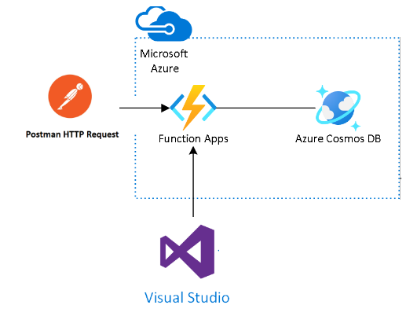

# Introduction 

# Instructions
bla-bla-bla .....a aplicação terá um volume de utilização em torno de 1.000 usuários simultâneos

Instruções gerais:
* [Download, install and run the cosmosDb emulator](https://na01.safelinks.protection.outlook.com/?url=https%3A%2F%2Flearn.microsoft.com%2Fpt-br%2Fazure%2Fcosmos-db%2Flocal-emulator%3Ftabs%3Dssl-netstd21&data=05%7C01%7C%7C4d8234d88a034cc69ebd08dbf66b97cf%7C84df9e7fe9f640afb435aaaaaaaaaaaa%7C1%7C0%7C638374714189918435%7CUnknown%7CTWFpbGZsb3d8eyJWIjoiMC4wLjAwMDAiLCJQIjoiV2luMzIiLCJBTiI6Ik1haWwiLCJXVCI6Mn0%3D%7C3000%7C%7C%7C&sdata=iYASCNvCdHMMr%2FCWdFjA%2Biq6Ooge6u%2BEjJ9BPa%2FAdKc%3D&reserved=0)
* The project made in the [versão 7.0 do netcore](https://na01.safelinks.protection.outlook.com/?url=https%3A%2F%2Fdotnet.microsoft.com%2Fen-us%2Fdownload%2Fdotnet%2F7.0&data=05%7C01%7C%7C4d8234d88a034cc69ebd08dbf66b97cf%7C84df9e7fe9f640afb435aaaaaaaaaaaa%7C1%7C0%7C638374714189918435%7CUnknown%7CTWFpbGZsb3d8eyJWIjoiMC4wLjAwMDAiLCJQIjoiV2luMzIiLCJBTiI6Ik1haWwiLCJXVCI6Mn0%3D%7C3000%7C%7C%7C&sdata=oNg1ck4UHly2KPZuH5L4B9GaI6%2BNAd3IYApgSv013LQ%3D&reserved=0)
* I made a postman collection with the endpoints at the root of the project - Barbecue Muller.postman_collection.json
* Json with environment variables to be imported into postman is also at the root of the project - local.postman_environment.json

# Tips - 
* code-review;
* Azure-Functions. 

# Contribute
TODO: Explain how other users and developers can contribute to make your code better. 

If you want to learn more about creating good readme files then refer the following [guidelines](https://docs.microsoft.com/en-us/azure/devops/repos/git/create-a-readme?view=azure-devops). You can also seek inspiration from the below readme files:
- [ASP.NET Core](https://github.com/aspnet/Home)
- [Visual Studio Code](https://github.com/Microsoft/vscode)
